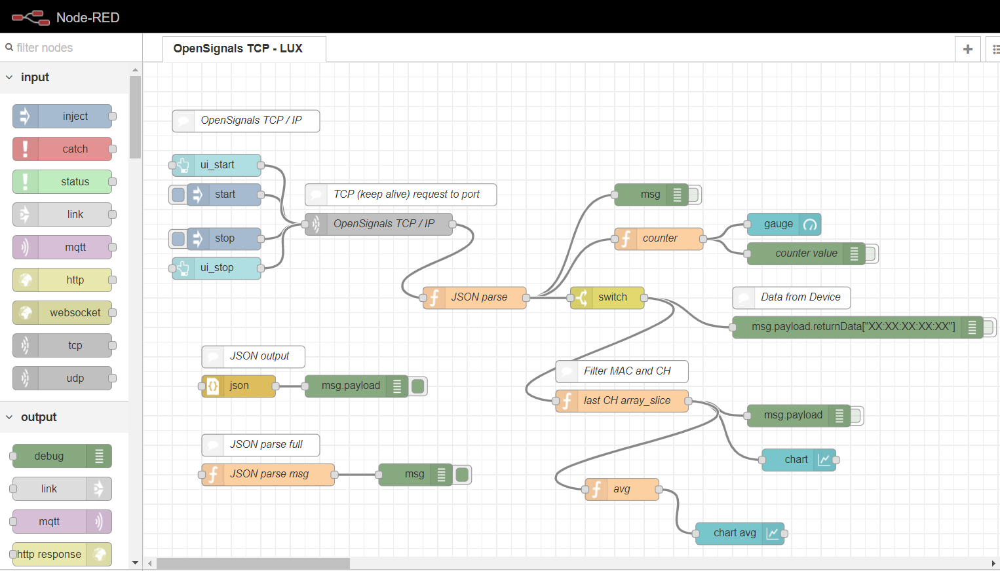
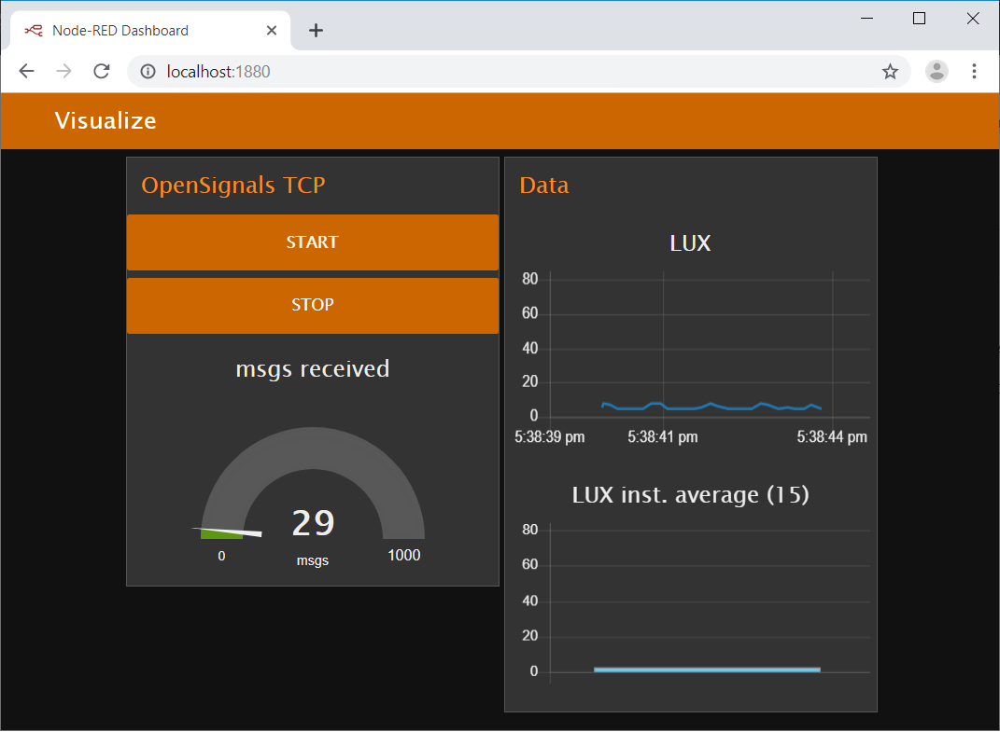

# Monitor LUX in a UI using OpenSignals Node-RED TCP / IP flow

This example showcases how a specific channel can be monitored and make use of Node-RED's user interface **dashboard** to access real-time vizualisation of data. 
You'll need to configure your device MAC address in the filtering and printing within the flow.  
This is the case of the switch and the 2 nodes connected to it. 

## Prerequisites  
[Node-RED Dashboard](https://github.com/node-red/node-red-dashboard) (see LICENSE.md)  

## Steps  
[1. Example Flow](#flow)  
[2. Description](#desc)  

##  1. Flow and UI   
### Downloadable JSON
[OpenSignals TCP / IP flow](/LUX_ui/OS_TCP_LUX_ui.json)  

### Interface

You should be able to see the following UI in your browser:

##  2. Description   
- Follow the [initial setup steps](https://github.com/malfarasplux/opensignals-nodered/#set)  
- Configure your MAC in the flow  
- Deploy, [launch the UI](http://localhost:1880/ui) and press start   
