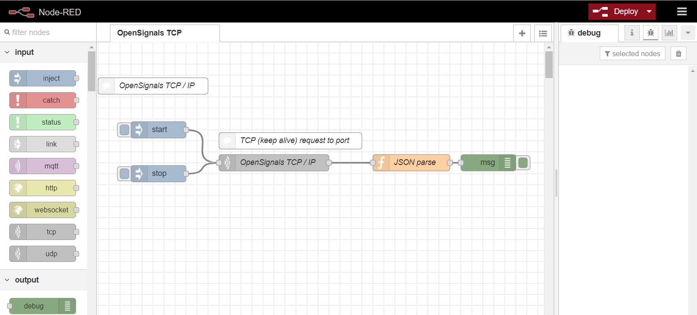

# Monitor LUX in a UI using OpenSignals Node-RED TCP / IP flow

This example showcases how a specific channel can be monitored and make use of Node-RED's user interface to access real-time vizualisation of data. 
You'll need to configure your device MAC address in the filtering and printing within the flow. 
[1. Flow](#flow)  
[2. Description](#desc)  

##  1. Flow   
[OpenSignals TCP / IP flow](/OS_TCP_LUX_ui.json)  

##  2. Description   
Follow the [initial setup steps](https://github.com/malfarasplux/opensignals-nodered/).
Configure your MAC in the flow.
Deploy, [launch the UI](http://localhost:1880/ui) and press start. 
